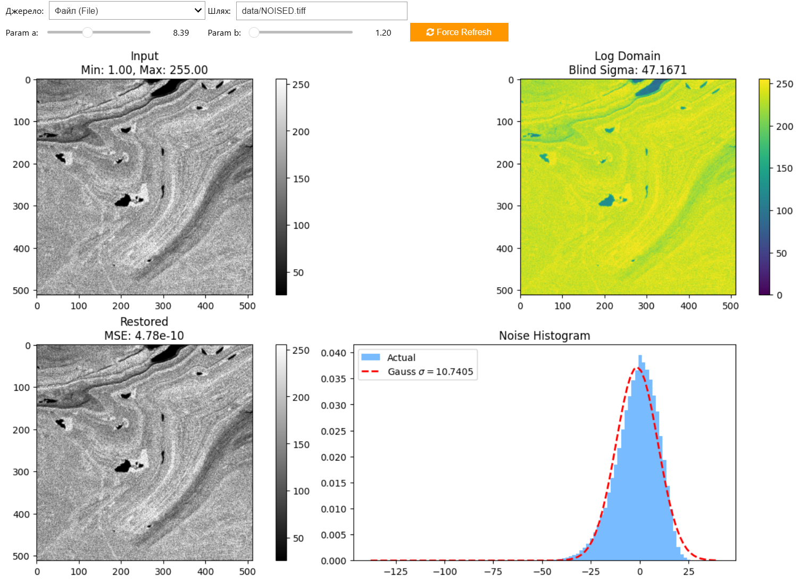
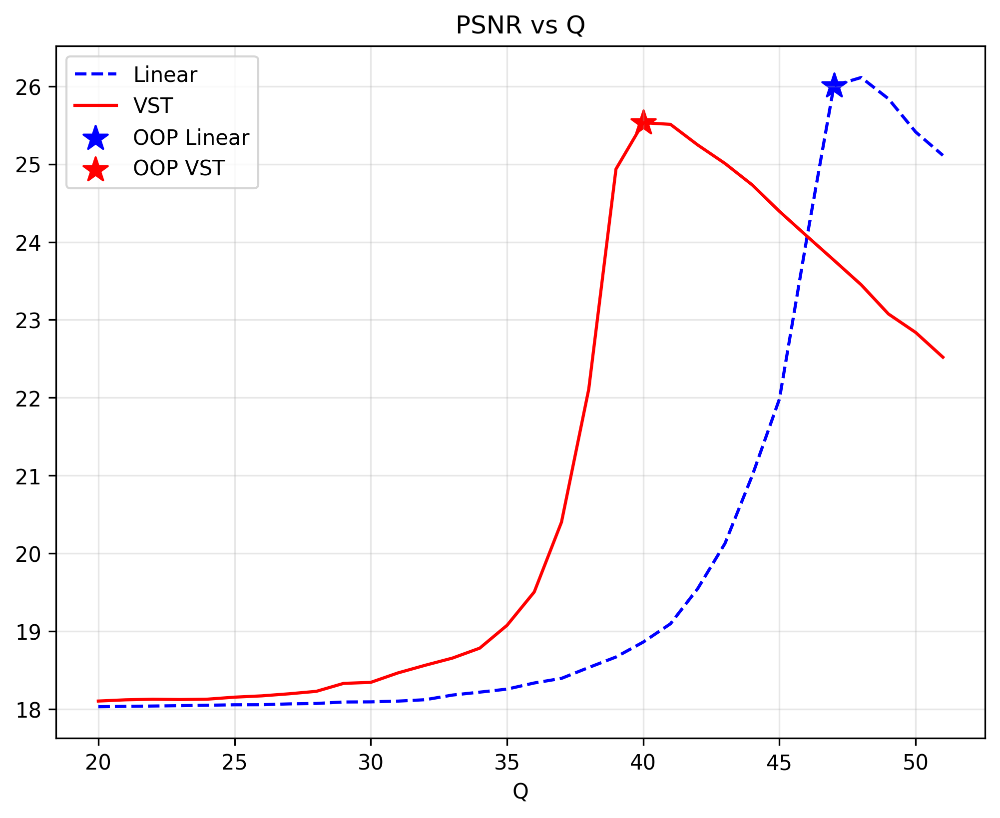
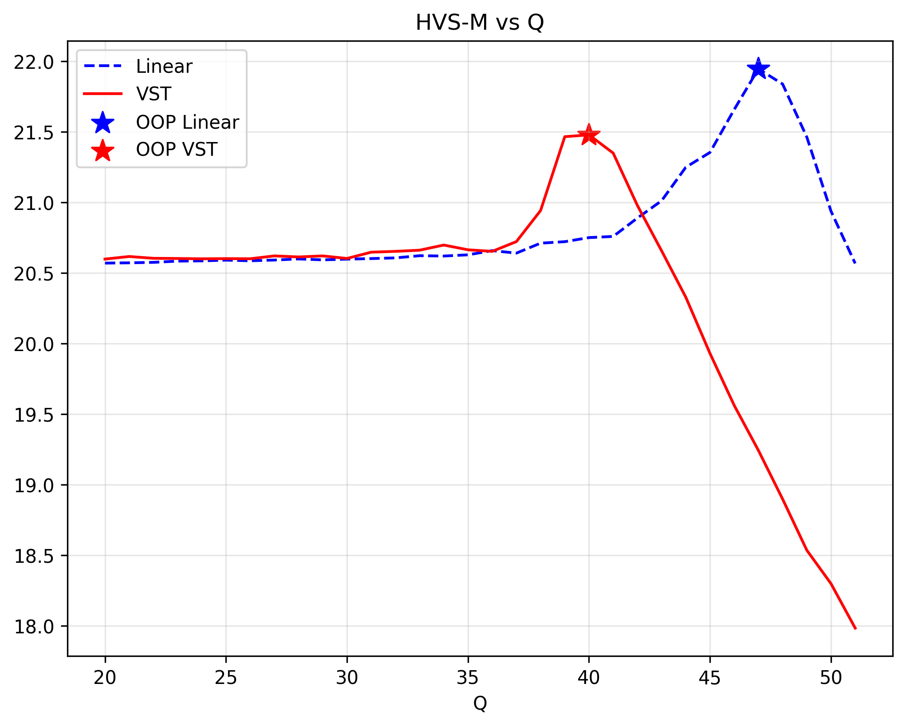
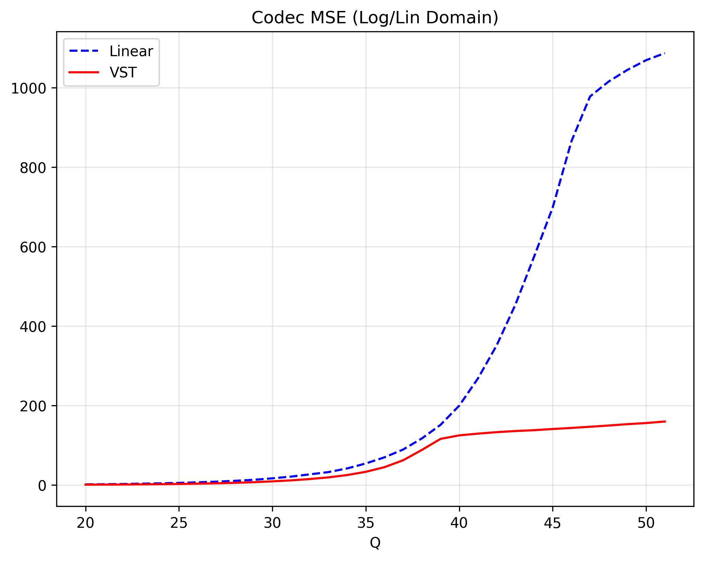

# SAR Image Processing — VST Demo

Interactive demo of a Variance Stabilization Transform (VST) pipeline for speckle noise reduction in synthetic SAR-like images and real TIFF data.

**Notebook:** `sample_interactive.ipynb` — an interactive widget-based notebook that lets you tweak VST parameters, noise level, and filtering settings.

## Requirements
Install the project dependencies:

```bash
python -m pip install -r requirements.txt
```

## Run the Notebook
Start Jupyter and open the notebook (or open it directly in VS Code):

```bash
jupyter notebook sample_interactive.ipynb
# or
jupyter lab sample_interactive.ipynb
```

## Visual Examples

**VST Denoising result:**


## VST Analysis & Verification

The project includes an exploration tool to verify the mathematical properties of the transformation before applying any filtering.



The analysis dashboard consists of four key panels:

1.  **Input (Linear Domain):** Displays the original noisy image. The noise here is **multiplicative** (Speckle), meaning its amplitude depends on the signal intensity (brighter areas have stronger noise). Standard Gaussian filters fail here.
2.  **VST (Log Domain):** The result of the forward transform. The noise becomes **additive** and its variance is **stabilized** (constant amplitude across dark and bright areas).
    *   *Blind Sigma:* The estimated noise standard deviation using the MAD (Median Absolute Deviation) method, useful when no ground truth is available.
3.  **Restored (Inverse):** The result of the inverse transform without any filtering.
    *   *MSE (Mean Squared Error):* Should be close to zero (e.g., $10^{-20}$), proving the transform is mathematically lossless and reversible.
4.  **Noise Histogram (The Scientific Proof):** Compares the actual noise distribution in the Log Domain (Blue bars) against an ideal Normal distribution (Red curve).
    *   **Goal:** If the blue histogram aligns with the red Gaussian curve, the VST successfully converted complex Speckle noise into standard Gaussian noise, allowing the use of conventional denoising algorithms (BM3D, DCT, Wavelets).

## Transforms

The notebook implements a parametric Variance Stabilization Transform (VST). The forward transform applied to image intensities $I$ is:

$$
T(I) = a \log_b I = \frac{a \ln I}{\ln b}
$$

The inverse transform (mapping back to intensity values) is:

$$
T^{-1}(y) = b^{y / a}
$$

When converting multiplicative speckle noise with standard deviation $\sigma_{\text{mult}}$ to an additive-equivalent standard deviation in the transformed domain, the notebook uses:

$$
\sigma_{\text{add}} = \frac{a\,\sigma_{\text{mult}}}{\ln b}
$$

**Variables:**
*   $a$ — scale parameter (controls the dynamic range in the log domain).
*   $b$ — logarithm base.
*   $I$ — input intensity.
*   $y$ — transformed value.

## Experiment Results (Metrics)

The framework evaluates the compression efficiency using both standard metrics (PSNR, MSE) and Human Visual System (HVS) based metrics (PSNR-HVS-M).

### 1. PSNR vs. Q (Quantization)

*   **Purpose:** Shows the traditional Rate-Distortion performance.
*   **Observation:** The VST approach (Red) typically maintains higher PSNR at various quality levels compared to Linear encoding (Blue), especially in dark regions where multiplicative noise is problematic. The star indicates the Optimal Operation Point (OOP).

### 2. HVS-M vs. Q

*   **Purpose:** Evaluates visual quality by accounting for Contrast Sensitivity Function (CSF) and masking effects.
*   **Observation:** HVS-M often aligns better with perceived quality. The VST method generally preserves visual details better, resulting in a higher HVS-M score.

### 3. Codec MSE

*   **Purpose:** Measures the internal Mean Squared Error of the codec in the domain it operates in.
*   **Observation:** This metric confirms the encoder's behavior in the transformed space vs the linear space.

### 4. Optimal Operation Point (OOP)
The framework identifies the OOP, which is the Quantization parameter ($Q$) that maximizes the chosen metric (e.g., PSNR-HVS-M).
*   **OOP Image (Linear):** Reconstruction using standard compression.
*   **OOP Image (VST):** Reconstruction using VST + Compression + Inverse VST.

### 5. Metrics Summary Table
A summary of the optimal operation points found for both methods from `assets/metrics.csv`:

| Method | Q(OOP) | PSNR_HVSM(OOP) | PSNR | HVS-M | MSE | Filesize (KB) | CR |
| :--- | :--- | :--- | :--- | :--- | :--- | :--- | :--- |
| **Standard space** | 35 | 39.30 | 42.99 | 39.30 | 6.16 | 0.9 | 178.6 |
| **VST space** | 22 | 34.02 | 39.98 | 34.02 | 12.35 | 1.4 | 112.8 |

**Columns Explanation:**
*   **Method:** The processing domain (Standard Linear or VST Logarithmic).
*   **Q(OOP):** The Quantization Step giving the best result for the selected metric.
*   **PSNR_HVSM(OOP):** The score of the target metric (if optimized for HVS-M) at OOP.
*   **PSNR / HVS-M:** Signal-to-Noise Ratio metrics at the OOP.
*   **MSE:** Mean Squared Error between the reconstructed OOP image and Original.
*   **Filesize (KB):** Size of the compressed BPG bitstream.
*   **CR:** Compression Ratio (Original Size / Compressed Size).

## Relative Error Map

The analysis framework now includes a **Relative Error Map** to visualize compression artifacts in the image domain relative to the signal strength.


**Formula:**
$$
\Delta(i,j) = 128 + 128 \times \left( \frac{I_{\mathrm{comp}}(i,j) - I_{\mathrm{true}}(i,j)}{I_{\mathrm{true}}(i,j)} \right)
$$

**Interpretation:**
*   This map is centered at **128 (Neutral Gray)**, which represents 0% relative error.
*   **Blue (Values < 128):** The compressed pixel is **darker** than the original (loss of energy/information).
*   **Red (Values > 128):** The compressed pixel is **brighter** than the original (ringing artifacts, noise amplification).
*   The range covers $\pm 100\%$ relative error clamped to $[0, 255]$.